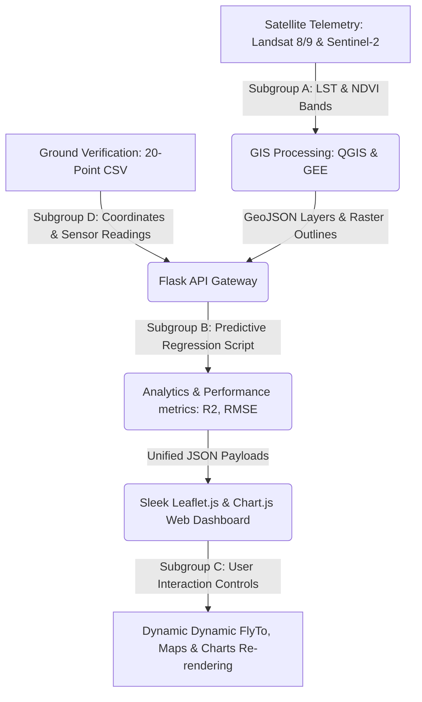

# 🌡️ Urban Heat Island Mapping & Predictive GIS Dashboard

Welcome to the **Urban Heat Island (UHI) Mapping & Analytics System**. This repository serves as a modular, high-end collaborative codebase designed for **Theory Project Group 4 (CSE 3-2)**. 

The system focuses on a high-resolution micro-analysis of **Mirpur 12** as the baseline ground-truth deployment and scales dynamically to divisional boundaries across Bangladesh: **Entire Dhaka Metropolitan Area**, **Sylhet**, **Rajshahi**, and **Chittagong**. It fuses satellite remote sensing data (specifically Land Surface Temperature and vegetation canopy ratios) with ground-truth sensor parameters to visualize thermal anomalies and support sustainable urban planning.

---

## 🗺️ System Architecture & Workflow

Understanding the data flow is key to smooth subgroup integration. The system routes spatial and environmental telemetry through three main stages:



---

## 👥 Granular Subgroup Collaboration Blueprint

To prevent merge conflicts and define clear engineering boundaries, the work is divided into four highly-focused subgroups. Follow the instructions below for your specific team:

### 📡 Subgroup A: GIS & Remote Sensing Leads
* **Core Mandate:** Satellite data acquisition, thermal infrared processing, calculating NDVI, and exporting regional vector boundaries.
* **Granular Technical Role:**
  1. Download Landsat 8/9 thermal bands and calculate **Land Surface Temperature (LST)**.
  2. Compute the **Normalized Difference Vegetation Index (NDVI)**:
     $$\text{NDVI} = \frac{\text{NIR} - \text{Red}}{\text{NIR} + \text{Red}}$$
  3. Export boundary maps as optimized GeoJSON structures.
* **Workspace Boundaries & Deliverables:**
  - `data/geojson/placeholders.js`: Replace the dummy bounding vectors inside `REGION_PRESETS[region].geojson` with your processed GeoJSON layers.
  - Coordinate with **Subgroup C** to align map bounds (`bounds` property in the presets object) so overlays render correctly on top of the base tiles.

---

### 🧠 Subgroup B: Backend & Analytics Leads
* **Core Mandate:** Server-side environment setup, API endpoint routing, data fusion, and lightweight statistical predictive modeling.
* **Granular Technical Role:**
  1. Develop Python Flask routes to parse ground telemetry CSVs and spatial GeoJSON layers.
  2. Implement the core **Lightweight Predictive Regression Engine** to analyze the inverse relationship between green cover (NDVI) and heat retention:
     $$\text{Predicted Temperature} = \alpha - (\beta \times \text{NDVI})$$
  3. Compute error metrics: Mean Absolute Error (MAE), Root Mean Squared Error (RMSE), and Coefficient of Determination ($R^2$ Score) to check fit quality.
* **Workspace Boundaries & Deliverables:**
  - `backend/app.py`: Maintain and extend endpoints. Ensure `/api/heat-data?region=<id>` responds instantly with the formatted JSON schema (see Data Contract).
  - `backend/models/analytics.py`: Refine the modeling calculations, optimize regression logic, or plug in advanced ML models (Random Forest, XGBoost) if implementing advanced features.

---

### 🎨 Subgroup C: Frontend & Map UI Leads
* **Core Mandate:** HTML5/CSS3 dashboard development, Leaflet.js interactive mapping integration, Chart.js statistics binding, and responsive glassmorphic styling.
* **Granular Technical Role:**
  1. Style the dashboard using modern web aesthetics (radial neon gradients, glassmorphism, responsive CSS grid grids).
  2. Wire up **Leaflet.js** to hard-center on Mirpur 12 and handle zoom levels.
  3. Bind Chart.js canvases to draw comparative analysis plots (Concrete vs. Vegetation surfaces).
  4. Write the dynamic client event listeners that fetch data on dropdown change and update the page via `map.flyTo()` and chart re-rendering.
* **Workspace Boundaries & Deliverables:**
  - `frontend/index.html`: Maintain structural layouts, SEO titles, and statistical HUD labels.
  - `frontend/css/styles.css`: Centralize design systems, cards, and micro-animations.
  - `frontend/js/app.js`: Manage AJAX fetch calls, map leaflet layer bindings, and Chart.js updates.

---

### ✍️ Subgroup D: Project Managers & Technical Writers (Your Group)
* **Core Mandate:** Baseline data synthesis, daily roadmap progress tracking, code freezing, report editing, and viva preparation.
* **Granular Technical Role:**
  1. Coordinate with all subgroups to ensure milestones are met according to the 12-day schedule.
  2. Manage and expand the **synthesized ground-truth verification database**.
  3. Author final report chapters (methodology, spatial analysis results) and format the presentation slides.
* **Workspace Boundaries & Deliverables:**
  - `data/environmental/mirpur12_ground_data.csv`: Update or expand the 20-point CSV dataset with actual physical parameters or expanded survey locations.
  - Keep project documentations stable and lead team viva simulation rehearsals.

---

## 📊 Shared Data Contract (API Schema)

To keep backend (Subgroup B) and frontend (Subgroup C) teams aligned, all data exchanged via `/api/heat-data?region=<region_id>` must adhere strictly to this schema:

```json
{
  "region": "mirpur12",
  "name": "Mirpur 12",
  "description": "Hyper-local baseline micro-analysis...",
  "analytics": {
    "alpha_intercept": 37.8331,
    "beta_slope": 13.3629,
    "avg_temp": 33.43,
    "r2_score": 0.9498,
    "rmse": 0.661,
    "mae": 0.5963,
    "peak_hotspot": {
      "name": "Ceramic Factory Area",
      "temp": 38.1,
      "lat": 23.8205,
      "lng": 90.3685
    },
    "peak_coolspot": {
      "name": "DOHS Lake Side Walkway",
      "temp": 28.5,
      "lat": 23.827,
      "lng": 90.363
    }
  },
  "records": [
    {
      "LocationID": 1,
      "LocationName": "Mirpur 12 Metro Station",
      "Latitude": 23.8248,
      "Longitude": 90.3621,
      "Temperature": 37.2,
      "SurfaceType": "Concrete",
      "NDVI": 0.08,
      "TrafficDensity": "High",
      "Time": "Afternoon"
    }
  ]
}
```

---

## 🏃 Quick-Start Development Guide

Follow these steps to spin up the codebase locally:

### 1. Set Up Your Environment
Ensure Python 3 is installed, then install the required lightweight data-science dependencies:
```bash
pip install flask pandas numpy scikit-learn --break-system-packages
```
*(Use `--break-system-packages` if developing on modern macOS with externally-managed Python environments, or activate a virtual environment).*

### 2. Launch the Development Server
From the root of the project directory, run:
```bash
python backend/app.py
```

### 3. Open the Dashboard
Navigate to:
```text
http://127.0.0.1:5000/
```
The interface will boot up instantly, default-centered over **Mirpur 12**, displaying real-time mapping layers, statistical charts, and regression metrics.
